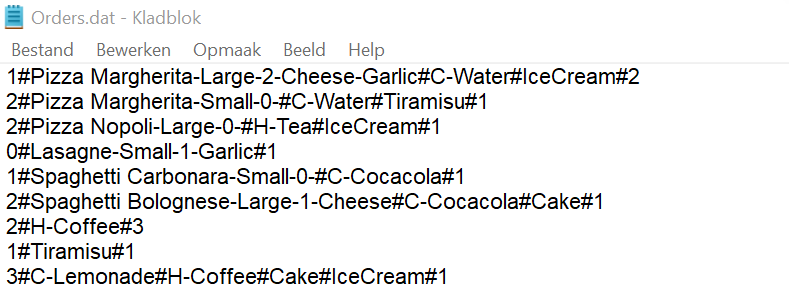

## PastaPizzaNet
A simple C# console application for a pasta and pizza restaurant. This was one of the assignments I did during the .NET training course.
The application can register an order, display all orders, group orders by customers and filter orders. It also can write orders to a text file and read them back in.

## Background
- A customer can order a full menu consisting of a dish (pasta or pizza), a drink (soft drink or hot drink) and a dessert.
- A customer can also only order a dish or a drink or a dessert or a combination of these.
- When ordering the dish, the customer can specify the size (small/large) (small = standard), and can also order the extras bread, cheese and/or garlic (examples of orders see screenshot below).

## Assignment requirements
You can view the detailed assignment requirements at [CSharpFundamentalsEndAssignment.md](CSharpFundamentalsEndAssignment.md).

## Results
- Display orders

- Group orders by customer

- Filter orders by customer name

- Write customers to a text file

- Write dishes to a text file

- Write orders to a text file

